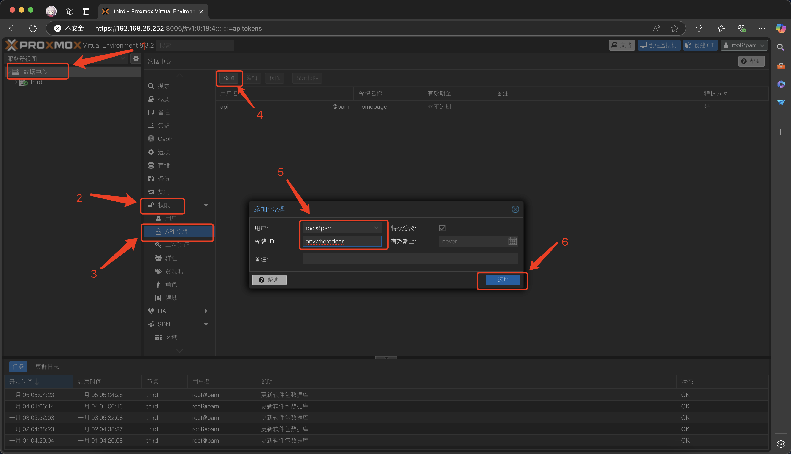
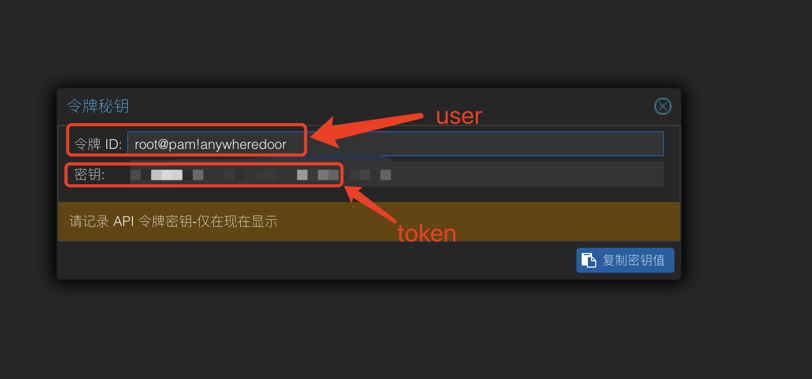
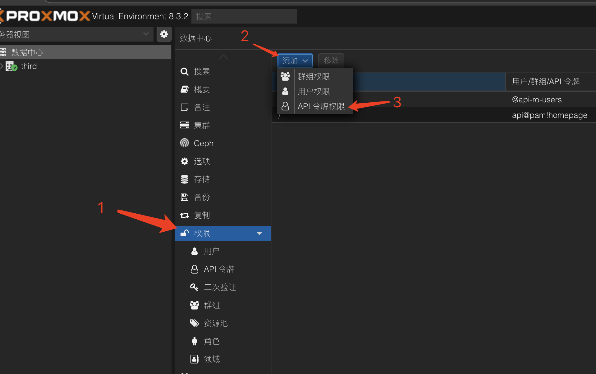
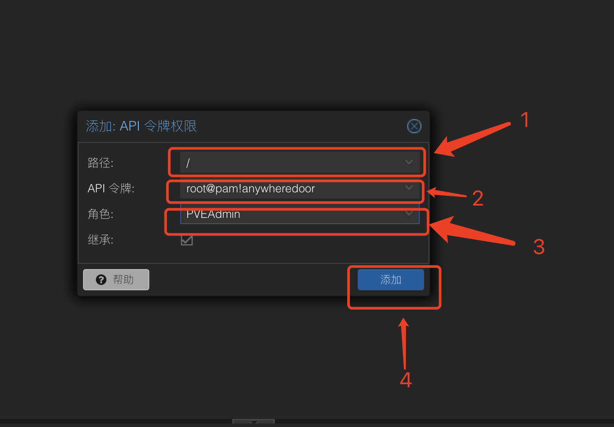

# anywhere-door-plugin-pve
AnywhereDoor Plugin PVE实现

## 环境变量
* HOST: 控制平面地址
* PORT: 控制平面端口
* PREFIX: 控制平面前缀
* USERNAME: plugin所属用户名称
* TOKEN: plugin令牌
* PLUGIN_NAME: plugin名称

## 打包方式
1. 将代码clone下来
2. 安装docker及buildx
3. 打包镜像
    * `docker buildx build --platform linux/amd64 -t 192.168.25.5:31100/maoyanluo/anywhere-door-plugin-pve:1.0 . --load`

## 部署方式

### Docker Command Line
1. 运行容器
   * `docker run --name anywhere-door-plugin-pve -itd -p 8085:80 -e HOST=ip -e PORT=port -e USERNAME=username -e TOKEN=token -e PLUGIN_NAME=pve --restart=always 192.168.25.5:31100/maoyanluo/anywhere-door-plugin-pve:1.0`

### Kubernetes
```yaml
apiVersion: apps/v1
kind: Deployment
metadata:
  name: anywhere-door-plugin-pve-deployment
  namespace: anywhere-door
spec:
  replicas: 1
  selector:
    matchLabels:
      app: anywhere-door-plugin-pve
  template:
    metadata:
      labels:
        app: anywhere-door-plugin-pve
    spec:
      containers:
      - name: anywhere-door-plugin-pve
        image: 192.168.25.5:31100/maoyanluo/anywhere-door-plugin-pve:1.0
        imagePullPolicy: IfNotPresent
        env:
        - name: HOST
          value: "anywhere-door-control-plane-service.anywhere-door"
        - name: PORT
          value: "80"
        - name: USERNAME
          value: username
        - name: TOKEN
          value: token
        - name: PLUGIN_NAME
          value: "pve"
        ports:
        - containerPort: 80
      restartPolicy: Always
---
apiVersion: v1
kind: Service
metadata:
  name: anywhere-door-plugin-pve-service
  namespace: anywhere-door
  labels:
    app: anywhere-door-plugin-pve
spec:
  type: ClusterIP
  ports:
  - port: 80
    targetPort: 80
  selector:
    app: anywhere-door-plugin-pve
```
## 使用方法
### 获取配置参数





### 注册插件
1. 保证容器正常运行
2. 注册plugin: POST AnywhereDoorManager/plugin/create & Header: token: token & Body: { "plugin_name": "name", "plugin_describe": "desc", "plugin_host": "anywhere-door-plugin-pve-service.anywhere-door", "plugin_port": 80, "plugin_token": "token" }
3. 增加plugin配置信息: POST AnywhereDoorManager/config/create & Header: token: token & Body: key: hosts, value: [{"name": "pve name", "address": "https://pve.host:8006", "user": "admin user", "token": "token"}]

